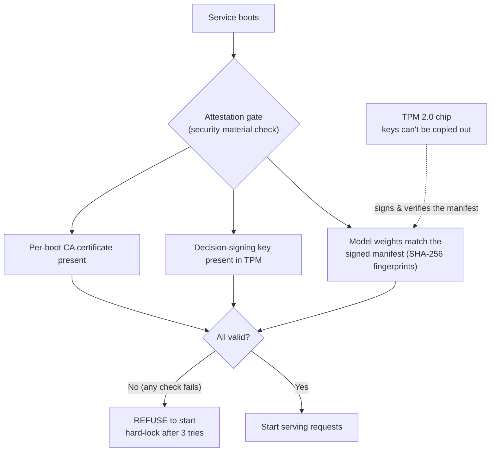

# Capstone Explainer (13-yo level) — Attestation (Boot-Time Trust Check)

**For:** #612 must-cover #8 (explain-to-a-13-year-old). **Audience:** technically literate but new to *this*
system; the spoken version should land for a non-technical interviewer.
**Status:** draft seed (2026-06-08); refine at deck-build. Target: ~2 slides, ≥1 a diagram.
**Grounding:** ADR-028 (Measured-Boot Attestation Scope); `shared/models/weight_integrity.py`,
`shared/models/manifest_signer.py` (read 2026-06-08); ADR-018 (TPM trust root); §5.9; #627.

---

## 1. The picture (the spoken, plain-language version)

Before the vault opens for business each morning, a trusted inspector does three checks — and if *any* fails,
the vault **refuses to open** (and after three failed tries, it locks down completely). The three checks:

1. **Are the precious documents the real ones?** Every important file (the AI's "brain" — its model weights)
   has a unique **fingerprint** (a SHA-256 hash). The inspector recomputes each fingerprint and compares it to
   a sealed **master list** (the "manifest"). One altered file ⇒ mismatch ⇒ stop.
2. **Is the master list itself genuine?** The list is **stamped with a wax seal** that can only be made by a
   stamp **locked inside a tamper-proof safe** (the **TPM** chip) — and that stamp can *never be taken out of
   the safe*. So even an attacker who swaps a document *and* rewrites the list can't forge the seal. The
   inspector checks the seal **before** even reading the list.
3. **Are the master keys and the ID-card printer present?** The key that signs BlarAI's security decisions
   lives in the TPM safe, and the certificate authority for the ID badges is present.

That whole morning inspection — proving the system is genuinely *itself* and *unmodified* before it's trusted
to run — is **attestation**.

## 2. Diagram sketch (the diagram slide)

*Caption idea: "The TPM is a tamper-proof safe whose keys never leave it. At boot, BlarAI proves its model,
keys, and certs are authentic — or it refuses to start."*

## 3. How it actually works (accurate mechanism — for grounding, not the kid-level slide)

- **The boot "attestation gate"** (ADR-028; PA `MeasuredBootStep` → `_validate_security_material`): confirms
  (a) the weight manifest is present and its digests valid, (b) the JWT TPM signing key is provisioned,
  (c) the per-boot CA cert is present. **Any failure ⇒ refuse to start; hard-lock after 3 attempts** (fail-closed).
- **Signature-before-content** (`weight_integrity.py:130-179`, `load_manifest_verified`): the manifest's TPM
  **signature is verified *first*** — an attacker who can write both `manifest.json` *and* its `.sig` still
  can't craft a valid pair without the **non-exportable TPM private key**. With `require_signed_manifest=true`
  (live), a tampered or unsigned manifest returns `None` ⇒ fail-closed. A wrong-but-present `.sig` is *always*
  fail-closed (blocks silent-downgrade attacks).
- **Then the digests** (`verify_weight_integrity` / multi-entry sweep, `weight_integrity.py`): every `.bin` is
  SHA-256'd and compared; an extra `.bin` not in the manifest also fails closed.
- **Root of trust = TPM 2.0** (ADR-018): the manifest-signing key, the JWT-signing key, and the DEK-seal key
  all live in the TPM, non-exportable.

## 4. Accuracy guardrails (say it right in interviews) — and the sharpest point

BlarAI's attestation today is **security-material validation** (the model, the keys, the certs). It does **not**
yet read **TPM PCR (Platform Configuration Register)** values — i.e. it does **not** do full **measured boot**
that attests the firmware/bootloader/OS boot-chain *below* BlarAI. That stronger control is **deliberately
deferred** to a tracked post-gate item (**#627**) — not discarded. The reason is the senior-level point worth
rehearsing (ADR-028):

- **Match the control to the threat.** The #598 gate clears the threat that *removing the air-gap* adds:
  **network** attack surface. PCR measured-boot defends a **physical** threat — an "evil maid" with hands on
  the powered-off machine altering the boot chain. They're **orthogonal**: the air-gap can come down safely
  without PCR measured-boot, and PCR measured-boot helps whether or not the air-gap is up.
- **Operational cost demands deliberate design.** PCR values legitimately change on every firmware/OS update;
  strict measured-boot fails-closed-on-boot until re-baselined (like BitLocker asking for a recovery key after
  a firmware update). On a decades-of-use daily driver that's recurring friction — it deserves its own design
  pass, not a gate-deadline rush.
- So the honest line is: *"BlarAI does fail-closed security-material attestation at boot; full PCR measured-boot
  is a tracked, deliberately-deferred hardening (#627) because it guards a physical threat orthogonal to the
  network gate."* That **threat-matching judgment** is itself the impressive part.

## 5. Why it's a strong interview topic

In ~2 minutes you can speak to:
1. **Root of trust / hardware-backed security** — keys that *cannot* be exported from a TPM, so signatures
   can't be forged even with full disk write access.
2. **Integrity verification** — fingerprints (hashes) + a signed manifest; signature-checked *before* content.
3. **Fail-closed / defense-in-depth** — refuse to start on any mismatch; hard-lock on repeated failure.
4. **Threat modeling maturity** — *matching a control to the threat it addresses*, and the judgment to defer an
   orthogonal control deliberately (and track it) rather than cargo-culting "measured boot" because it sounds
   strong. Interviewers love a candidate who can say *why not* as precisely as *why*.
