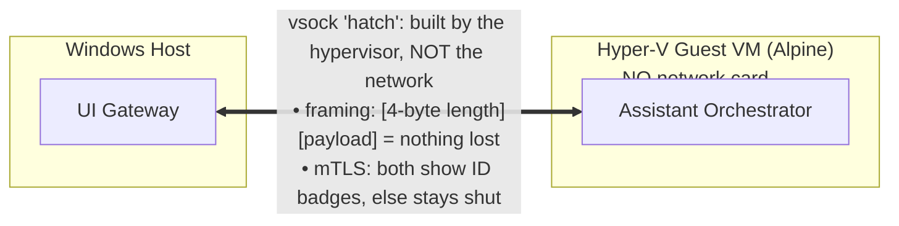

# Capstone Explainer (13-yo level) — Host ↔ Guest Isolation & Secure Data Flow

**For:** #612 must-cover #8 (explain-to-a-13-year-old) + #4 (data flows). **Audience:** technically literate
but new to *this* system; the spoken version should land for a non-technical interviewer.
**Status:** draft seed (2026-06-08); refine at deck-build. Target: ~2 slides, ≥1 a diagram.
**Grounding:** `shared/ipc/vsock.py` (read 2026-06-08); project memory `blarai_host_mode_default_topology`; #615.

---

## 1. The picture (the spoken, plain-language version)

BlarAI's brain can live in a **sealed vault with no windows and no doors to the street**. In the full
isolation design, the "guest" is a **virtual machine with no network card at all** — so nothing on the
internet can even reach it. But the vault still has to pass notes to the outside room (the "host"). It does
that through **one special hatch the building itself builds into the wall** — a channel called **vsock**.
The crucial part: that hatch does **not** connect to the street or the hallways (the network). It's a
private pass-through between exactly those two rooms.

- **How nothing gets lost:** every note has its **page-count written on the envelope** — literally a
  4-byte number on the front saying "this message is N bytes." The receiver reads that number first, then
  takes *exactly* N bytes — never one short, never two messages smeared together. (Capped at 64 KB so no
  single note can flood the hatch.)
- **How it stays secure:** both people at the hatch must show an **ID badge** (a TLS certificate) issued by
  the same trusted office (a fresh authority created at every boot). *Each* side checks the *other's* badge
  — that's *mutual* TLS, "mTLS." Missing or fake badge → the hatch **stays shut** (fail-closed). Everything
  through it is in a **sealed, scrambled envelope** only those two can open (encryption).

## 2. Diagram sketch (the diagram slide)

*Caption idea: "The guest has no network card. The only way in or out is the hypervisor's vsock hatch —
length-framed so nothing is lost, mutually-authenticated and encrypted so nothing leaks."*

## 3. How it actually works (accurate mechanism — for grounding, not the kid-level slide)

- **Two production topologies, selected by `host_mode`** (`vsock.py:13-34`, `255-264`):
  - `host_mode=True` (**default today**, "fidelity-2"): all services on one Windows host; channel = **AF_INET
    loopback `127.0.0.1` + mTLS**. Loopback never leaves the machine (air-gap compliant).
  - `host_mode=False` (**guest topology, #615**): services inside the Hyper-V VM; channel = **AF_HYPERV +
    mTLS** across the VM boundary.
- **Framing** (`vsock.py:36`, `63-65`, `266-269`): `send()` writes `[4-byte big-endian length][payload]`;
  `receive()` reads the 4-byte header, then reads *exactly* N bytes. Max 64 KB (`max_message_bytes`,
  `vsock.py:172-173`). This is the "without getting lost" guarantee.
- **mTLS** (`vsock.py:181-230`): server and client SSL contexts both set `CERT_REQUIRED` (each verifies the
  other against the per-boot CA), `minimum_version = TLSv1_2`; bare/non-mTLS connections rejected
  fail-closed; per-boot certs from the launcher.
- **AF_HYPERV addressing** (`vsock.py:75-117`): Windows Hyper-V sockets address by a **GUID pair
  `(VmId, ServiceId)`** + `HV_PROTOCOL_RAW` — *not* the Linux `(cid, port)` form (that mismatch was the #615
  addressing bug). The guest has no NIC, so vsock is the only host↔guest channel (`phase2_gates/evidence/
  vsock_validation.json` confirmed a real Win11→Alpine round-trip, 0 NICs).

## 4. Accuracy guardrails (say it right in interviews)

- **Today's default is host-mode** — everything's on one machine talking over loopback + mTLS, which
  *physically cannot* leave the computer. Say "the gateway and the assistant talk over an internal,
  loopback channel that's mutually authenticated and encrypted."
- **The VM-guest version (the sealed vault) is the *designed* hardening, finished under #615** — not the
  running default. Both use the **same framing and the same mTLS**; the only difference is loopback-on-one-
  machine vs vsock-across-the-VM-wall. Never claim the VM isolation is "what runs by default."
- `dev_mode=True` drops mTLS (loopback only) — a **test-only** path, never production.

## 5. Why it's a strong interview topic

In ~2 minutes you can speak to five transferable security fundamentals, with a concrete system to point at:
1. **Reducing attack surface** — a guest with no network card cannot be reached from the internet at all.
2. **Secure inter-process communication (IPC)** — a private hypervisor channel instead of the network.
3. **Mutual authentication** — *both* sides prove identity (mTLS), not just the server (unlike normal HTTPS).
4. **Fail-closed design** — no valid certificate ⇒ no connection; the default is "deny."
5. **Reliable message framing** — length-prefix so messages can't be lost, truncated, or run together.
